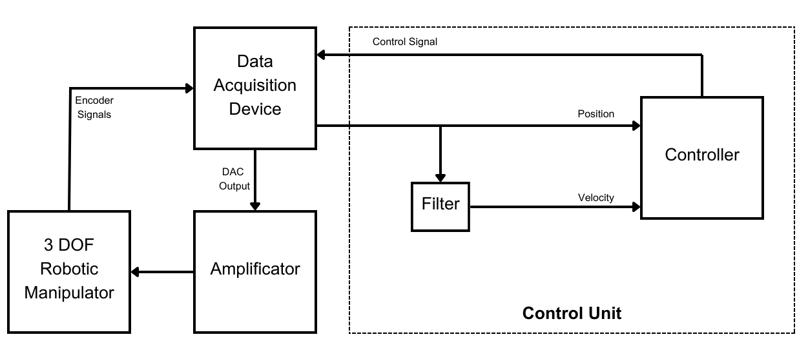

# Roman3D: 3 DOF Planar Robotic Manipulator

## Overview

This repository contains all the necessary components for constructing and operating a 3-DOF planar direct drive robotic manipulator. The project includes:

- **Hardware Overview**: The schematic and layout of the data acquisition card.
- **Control Unit**: A MATLAB project template for implementing and simulating control algorithms.
- **Embedded Code**: Software running on the data acquisition card.
- **CAD Model**: A comprehensive model of the robotic design.

You can find a series of posts about this project on [my personal website](https://sametgul.github.io/categories/roman3d-a-comprehensive-guide-to-constructing-a-3-dof-planar-robotic-manipulator/).

Figure 1 illustrates the schematic of the experimental setup. The control algorithms, referred to as the `Control Unit`, are implemented in MATLAB/Simulink. The custom `Data Acquisition Device` collects encoder signals from the robot and transmits them to the `Control Unit`. It also converts control signals from the `Control Unit` into voltages, which are then amplified by the `Amplificator` before being sent to the `3-DOF Robotic Manipulator`. These experiments are conducted in real-time with a sampling rate of up to 10 kHz.

_Figure 1: Experimental Setup Schematic_

## Documentation

For detailed documentation on each component, please refer to the following sections:

- [Control Unit Implementation](/docs/matlab_template.md)
